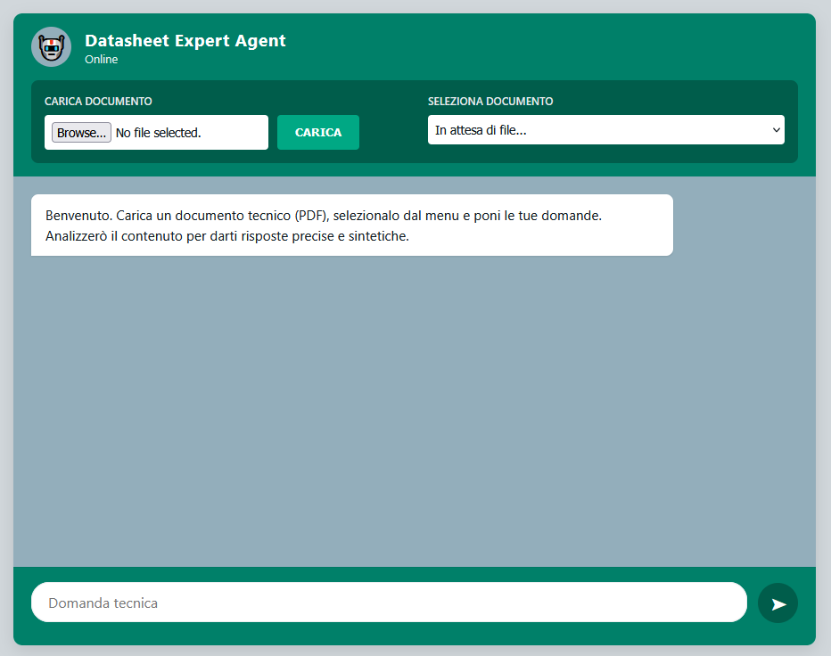
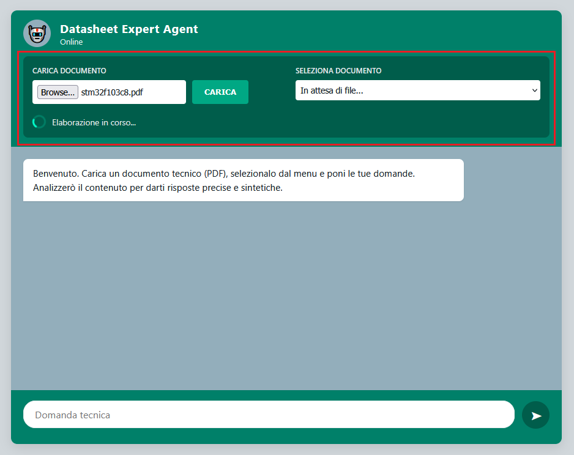
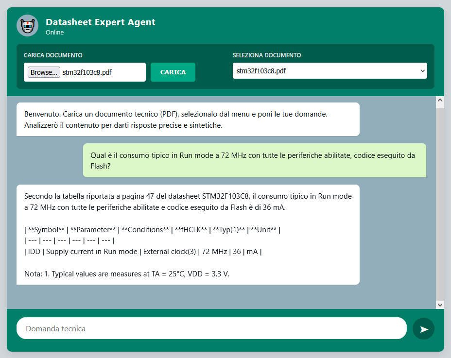

# Datasheet Expert Agent

A RAG (Retrieval-Augmented Generation) system for extracting precise technical
data from microcontroller datasheets and complex PDF documents.
Built with LlamaIndex, ChromaDB, and Groq.

  

---

## What it does

Upload any technical PDF (datasheets, manuals, specifications) and ask
questions in natural language. The system retrieves the most relevant
document sections and generates accurate, source-cited answers —
including table values, page references, and operating conditions.

**Example queries:**
- *"What is the typical current consumption at 72 MHz with all peripherals enabled?"*
- *"What is the absolute maximum voltage on VDD?"*
- *"How many SPI interfaces does the LQFP48 package expose?"*

---

## Architecture
```
PDF → PyMuPDF → per-page Markdown → pre-processing → LlamaIndex Documents
                                                              ↓
                                                      ChromaDB (vectors)
                                                              ↓
User query → multilingual embedding → top-k retrieval → Groq LLM → answer
```

**Key design decisions:**

**chunk_size=512** — Large chunks produce generic embeddings
that flatten similarity scores. At 512 tokens, each chunk maps to a specific
table or paragraph, making retrieval significantly more precise.

**ToC removal** — PyMuPDF renders the Table of Contents as markdown table rows
with dotted leaders. Left in, these rows match almost every technical query
(they explicitly list section names) causing systematic false positives.
A targeted regex strips them before indexing.

**Per-page Documents with page_number metadata** — Each PDF page becomes a
separate Document. This preserves page references so the LLM can cite
"Table 13, page 40" in its answers, and prevents the cover page (which
contains the dense Features summary) from being merged with ToC content.

**Features anchor Document** — The cover page's Features section is indexed
as a standalone Document with an explicit section tag. This guarantees
high similarity scores for general device spec queries regardless of which
chunks appear in top-k.

**Three-level cache** — ChromaDB (instant) → .md cache (skip PDF parsing)
→ raw PDF (full pipeline). Avoids redundant processing on repeated uploads.

**Multilingual embedding (multilingual-e5-small)** — Handles Italian queries
against English technical text without explicit translation.

---

## Tech stack

| Component | Technology |
|---|---|
| Backend | Flask |
| RAG framework | LlamaIndex |
| Vector store | ChromaDB |
| PDF parsing | PyMuPDF / pymupdf4llm |
| Embeddings | intfloat/multilingual-e5-small (HuggingFace) |
| LLM | Llama 3.1 8B via Groq API |
| Frontend | Vanilla JS, HTML, CSS |
| Containerization | Docker / Docker Compose |

---

## Setup & Installation

### Prerequisites
- Python 3.11+
- A [Groq API key](https://console.groq.com) (free tier available)
- [Docker Desktop](https://www.docker.com/products/docker-desktop/) (optional, for containerized setup)

### Option 1 — Local setup

```bash
# 1. Clone the repository
git clone https://github.com/flaviodell/datasheet-expert-agent.git
cd datasheet-expert-agent

# 2. Create and activate a virtual environment
python -m venv venv
source venv/bin/activate        # Linux/macOS
venv\Scripts\activate           # Windows

# 3. Install dependencies
pip install -r requirements.txt

# 4. Configure environment variables
cp .env.example .env
# Edit .env and add your Groq API key

# 5. Run the application
python app.py
```

Open your browser at `http://localhost:5000`.

### Option 2 — Docker

```bash
# 1. Clone the repository
git clone https://github.com/flaviodell/datasheet-expert-agent.git
cd datasheet-expert-agent

# 2. Configure environment variables
cp .env.example .env
# Edit .env and add your Groq API key

# 3. Build and start the container
docker compose up --build
```

Open your browser at `http://localhost:5000`.

To stop the container:
```bash
docker compose down
```

> **Data persistence:** uploaded PDFs, ChromaDB indexes, and parsed cache are
> stored in named Docker volumes and survive container restarts.

---

## Usage

1. Upload a PDF using the top-left control.
2. Select the document from the dropdown.
3. Type your question and press Enter.

The first upload triggers PDF parsing and indexing (takes ~30s for a
100-page document). Subsequent uploads of the same file load instantly
from cache.

To force re-indexing after changing chunking parameters, call:
```
POST /reindex  {"filename": "file.pdf", "invalidate_cache": false}
```

---

## Stress test results

See [STRESS_TEST.md](STRESS_TEST.md) for the full Q&A evaluation across
11 queries covering general specs, table extraction, operating regime
distinction, and cross-reference lookups.

---

## License
MIT